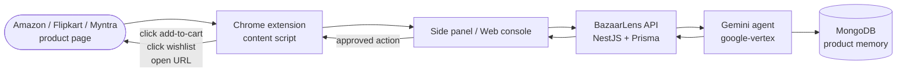
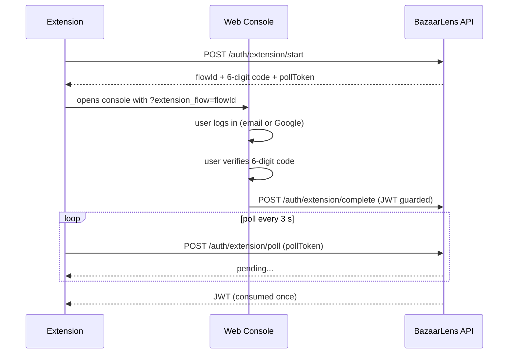

<div align="center">
  
  <h1>BazaarLens</h1>
  <p><strong>AI shopping copilot for Indian ecommerce.</strong><br/>
  Analyses product pages on Amazon.in, Flipkart, and Myntra and gives you a plain-language buying verdict before you add anything to your cart.</p>

[](https://github.com/aryan877/bazaarlens/actions/workflows/ci.yml)
[](LICENSE)
[](https://bazaarlens.xyz)

</div>

---

## How It Works



Every buying check follows the same path: the extension extracts the product page, the agent analyses it against your intent and past decisions, and the side panel shows you the verdict. Nothing is executed in your browser until you approve it.

---

## Auth Flow



---

## Features

| | |
|---|---|
| **Smart buying verdicts** | Gemini analyses price history signals, seller trust, return windows, warranty, fake discounts, delivery estimates, and size risk for every product |
| **Approval-gated actions** | Add-to-cart, wishlist, and comparison actions require explicit user approval; checkout, payment, OTP, and credential entry are outside scope by design |
| **Product memory** | MongoDB MCP server stores past decisions so the agent learns your preferences over time |
| **Multi-site extraction** | Amazon.in (DOM + JSON-LD), Flipkart (DOM + JSON fallback), Myntra (DOM + `window.__myx` fallback), and a generic fallback |
| **Google Agent Platform** | BazaarLens registers as an A2A agent with a public agent card and supports JSON-RPC and HTTP+JSON transports |
| **Extension account linking** | No passwords in the extension — a short-lived 6-digit code ties the extension to your web account |
| **Audit trail** | Every analysis, approval, and auth event is logged in Postgres |

---

## Stack

| Layer | Technology |
|---|---|
| AI agent | Google Gemini via `@ai-sdk/google-vertex` |
| API | NestJS 11 · Prisma 6 · PostgreSQL |
| Product memory | MongoDB MCP server (official) |
| Web console | React 19 · Vite · shadcn/ui · Tailwind CSS 4 |
| Chrome extension | WXT · React · MV3 |
| Validation | Zod 4 across all layers |
| Observability | OpenTelemetry → Arize Phoenix (optional) |

---

## Live

| | |
|---|---|
| Web console | https://bazaarlens.xyz |
| API health | https://api.bazaarlens.xyz/health/ready |
| Swagger | https://api.bazaarlens.xyz/docs |
| A2A agent card | https://api.bazaarlens.xyz/.well-known/agent.json |

---

## Quick Start

```bash
cp .env.example .env
# add GOOGLE_VERTEX_API_KEY (or GOOGLE_VERTEX_PROJECT + ADC) to .env
pnpm install
pnpm docker:dev:up
```

Local dev:

- Web console: `http://localhost:3000`
- API health: `http://localhost:8787/health/ready`
- Swagger: `http://localhost:8787/docs`

---

## Chrome Extension

```bash
# dev build pointing at local API
WXT_API_URL=http://localhost:8787 pnpm --filter @bazaarlens/extension build
```

1. Open `chrome://extensions` and enable **Developer mode**
2. **Load unpacked** → `apps/extension/.output/chrome-mv3`
3. Open `http://localhost:3000`, sign in, then click **Connect extension** in the side panel
4. Navigate to any Amazon.in, Flipkart, or Myntra product page and click **Check this product**

---

## Project Layout

```
bazaarlens/
├── packages/
│   ├── shared/          # Zod schemas and DTOs shared across all apps
│   └── agent/           # Gemini buying-agent engine
├── apps/
│   ├── api/             # NestJS API (auth, agent, A2A, MCP, Prisma)
│   ├── web/             # React web console (shadcn/ui)
│   └── extension/       # Chrome MV3 extension (WXT)
├── deploy/              # Reverse proxy and compose configs
└── scripts/             # Deploy, smoke-test, and validation scripts
```

---

## Commands

```bash
pnpm test              # unit + DOM tests
pnpm typecheck         # TypeScript across all packages
pnpm build             # shared -> agent -> api + web + extension
pnpm verify            # test + typecheck + build

pnpm docker:up         # production-style Docker stack
pnpm docker:dev:up     # bind-mounted dev stack (Vite + Nest watchers)
pnpm smoke:docker      # API health -> register -> analyze -> approve -> history
pnpm smoke:sites       # live Amazon/Flipkart/Myntra extraction smoke
pnpm extension:validate
```

---

## Team

- **Aryan Kumar** — [aryan877](https://github.com/aryan877)
- **Sweta Agarwal** — [birdiebuddy-code](https://github.com/birdiebuddy-code)
